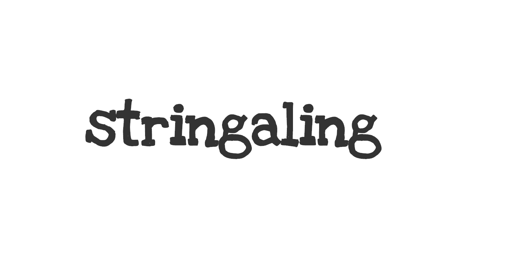

<div align="center">
  
</div>
<div align="center">
  <strong>Collection of string manipulation helpers</strong>
</div>
<div align="center">
  <a href="https://npmjs.org/package/stringaling">
    
  </a>
  <a href="https://npmjs.org/package/stringaling">
  
  </a>
  <a href="https://github.com/feross/standard">
    
  </a>
  <a href="https://github.com/prettier/prettier">
    
  </a>
  <a href="https://travis-ci.org/tiaanduplessis/stringaling">
    
  </a>
  <a href="https://github.com/tiaanduplessis/stringaling/blob/master/LICENSE">
    
  </a>
  <a href="http://makeapullrequest.com">
    
  </a>
</div>
<br>
<div align="center">
  <a href="https://github.com/tiaanduplessis/stringaling/watchers">
    
  </a>
  <a href="https://github.com/tiaanduplessis/stringaling/stargazers">
    
  </a>
  <a href="https://twitter.com/intent/tweet?text=Check%20out%20stringaling!%20https://github.com/tiaanduplessis/stringaling%20%F0%9F%91%8D">
    
  </a>
</div>
<br>
<div align="center">
  Built with ❤︎ by <a href="https://github.com/tiaanduplessis">tiaanduplessis</a> and <a href="https://github.com/tiaanduplessis/stringaling/contributors">contributors</a>
</div>

<h2>Table of Contents</h2>
<details>
  <summary>Table of Contents</summary>
  <li><a href="#install">Install</a></li>
  <li><a href="#usage">Usage</a></li>
  <li><a href="#api">API</a></li>
  <li><a href="#contribute">Contribute</a></li>
  <li><a href="#license">License</a></li>
</details>

## Install

```sh
$ npm install stringaling
# OR
$ yarn add stringaling
```

## Usage - TODO

## API - TODO

## Contributing

Contributions are welcome!

1. Fork it.
2. Create your feature branch: `git checkout -b my-new-feature`
3. Commit your changes: `git commit -am 'Add some feature'`
4. Push to the branch: `git push origin my-new-feature`
5. Submit a pull request :D

Or open up [a issue](https://github.com/tiaanduplessis/stringaling/issues).

## License

Licensed under the MIT License.
